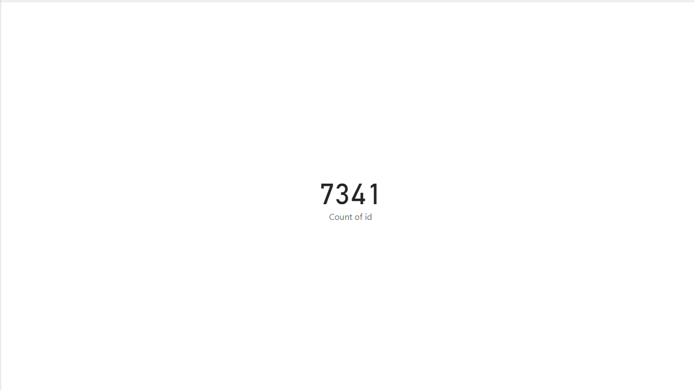
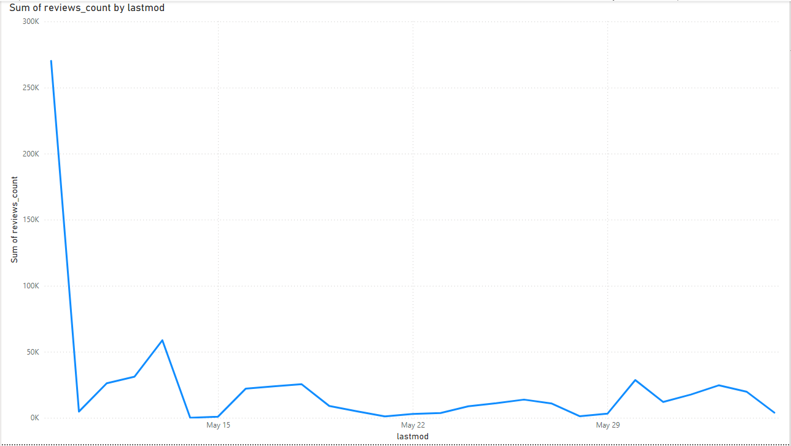
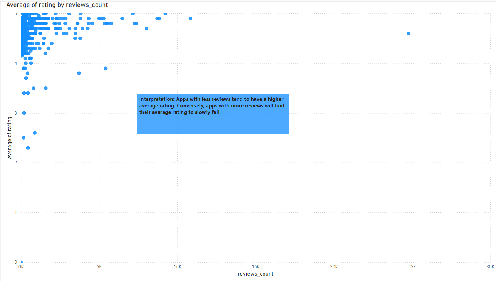
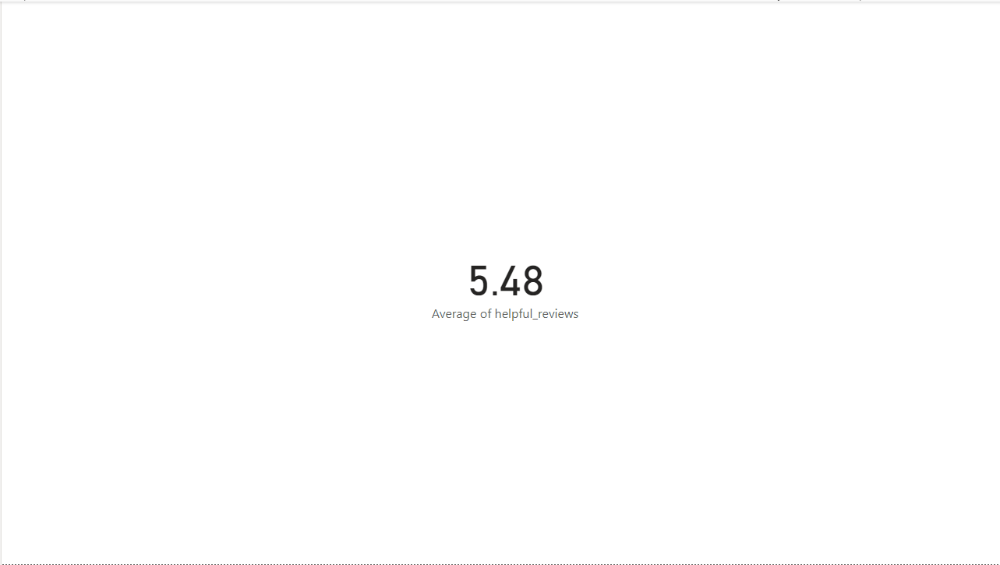
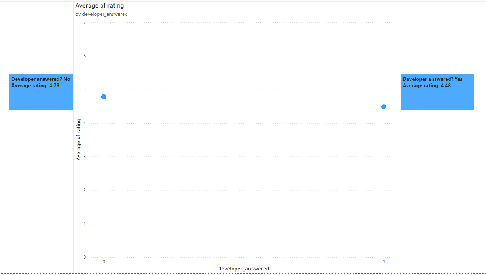
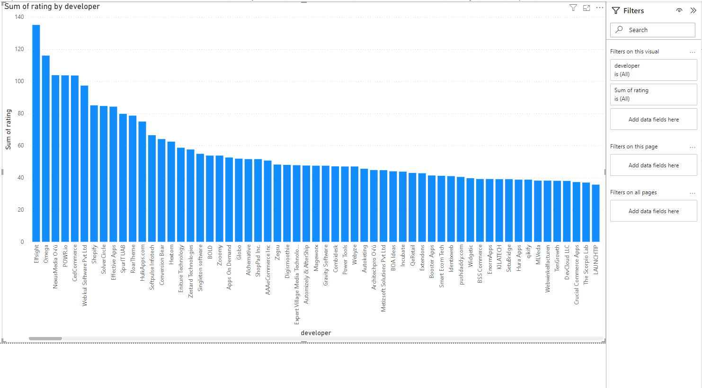
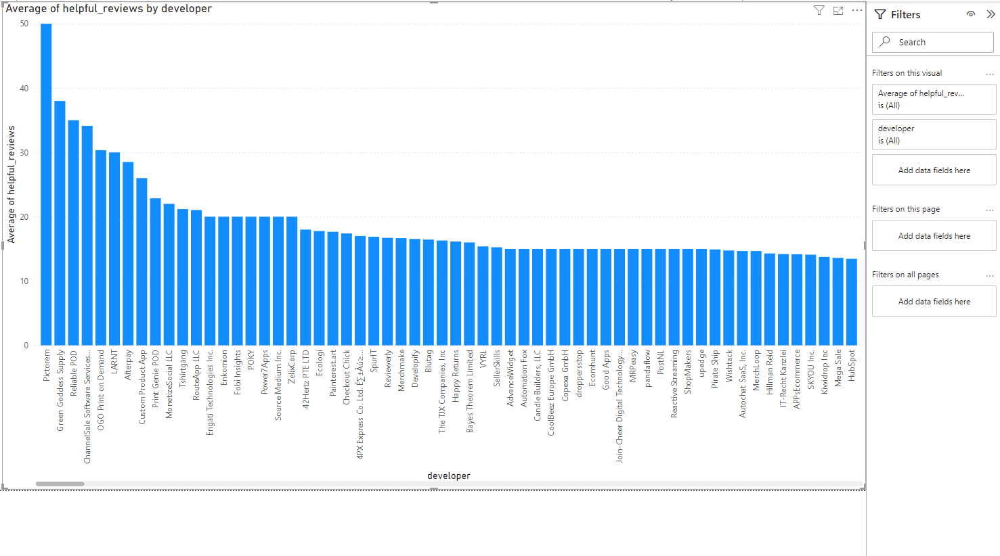
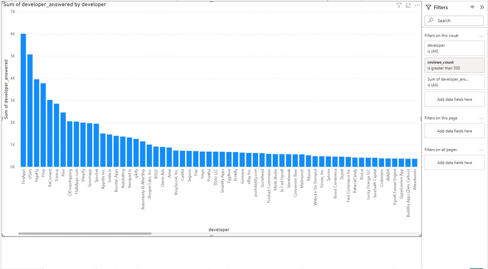

# 📱 App Developer Performance Analysis – Power BI

## 🚀 Overview  
This project analyzes app developer performance using key engagement metrics such as review count, average ratings, and developer responsiveness. The goal is to identify trends and provide insights that inform platform strategy and improve app quality.

## 🔍 Objective  
To uncover performance patterns across thousands of apps by exploring review data, developer responsiveness, and rating behaviors. This dashboard helps stakeholders quickly identify top-performing developers and key areas for improvement.

## 🛠️ Tools & Techniques  
- **Power BI** – Dashboard development and data modeling  
- **DAX** – Custom measures for average ratings and weighted insights  
- **Data Visualization** – KPI cards, slicers, and bar charts for trend analysis  
- **Metrics Tracked** – Review counts, average ratings, helpful reviews, developer responsiveness

---

## 📸 Dashboard Previews

### 🔹 App Overview  
**Screenshot:** `app-overview.png`  
Displays the count of unique apps included in the dataset. Useful for understanding the dataset size and filtering scope.

---

### 🔹 Review Count by Last Modified Date  
**Screenshot:** `review-cnt-by-lastmod-date.png`  
Shows the total review volume over time using the last modified date as a proxy for engagement activity.

---

### 🔹 Average Rating by Review Volume  
**Screenshot:** `avg-rating-by-review-count.png`  
Reveals the relationship between how often an app is reviewed and its average rating.

---

### 🔹 Average “Helpful Review” Rating  
**Screenshot:** `average-of-helpful-reviews.png`  
Displays the average rating from reviews marked as helpful, offering insight into meaningful user feedback.

---

### 🔹 Responsive vs. Non-Responsive Developers  
**Screenshot:** `average-rating-resp-vs-nonresp-devs.png`  
Compares average ratings between apps with developers who respond to reviews and those who do not.

---

### 🔹 Total Ratings by Developer  
**Screenshot:** `ratings-by-dev.png`  
Highlights which developers receive the most ratings, providing insight into app popularity.

---

### 🔹 Helpful Reviews by Developer  
**Screenshot:** `avg-helpful-reviews-by-dev.png`  
Measures average helpful review scores for each developer to identify top-quality contributors.

---

### 🔹 Most Responsive Developers (500+ Reviews)  
**Screenshot:** `most-resp-devs.png`  
Ranks developers with 500+ reviews by their responsiveness, showcasing those actively engaging with their user base.

---

## ✅ Key Insights  
- Developers who respond to reviews generally receive **higher average ratings**  
- A handful of developers dominate both **review volume and helpful review scores**  
- There’s a clear correlation between **engagement and perceived app quality**

## 📂 Files Included  
- `PowerBI_AppDashboard.pbix` *(optional – or remove this line if not included)*  
- `visuals/`: All screenshots used in this README  
- `README.md`: Full project documentation

## 🧠 Conclusion  
This analysis provides platform teams with a clear understanding of developer performance and user engagement. These insights can support platform curation, developer incentives, and improved user experiences across the app ecosystem.
